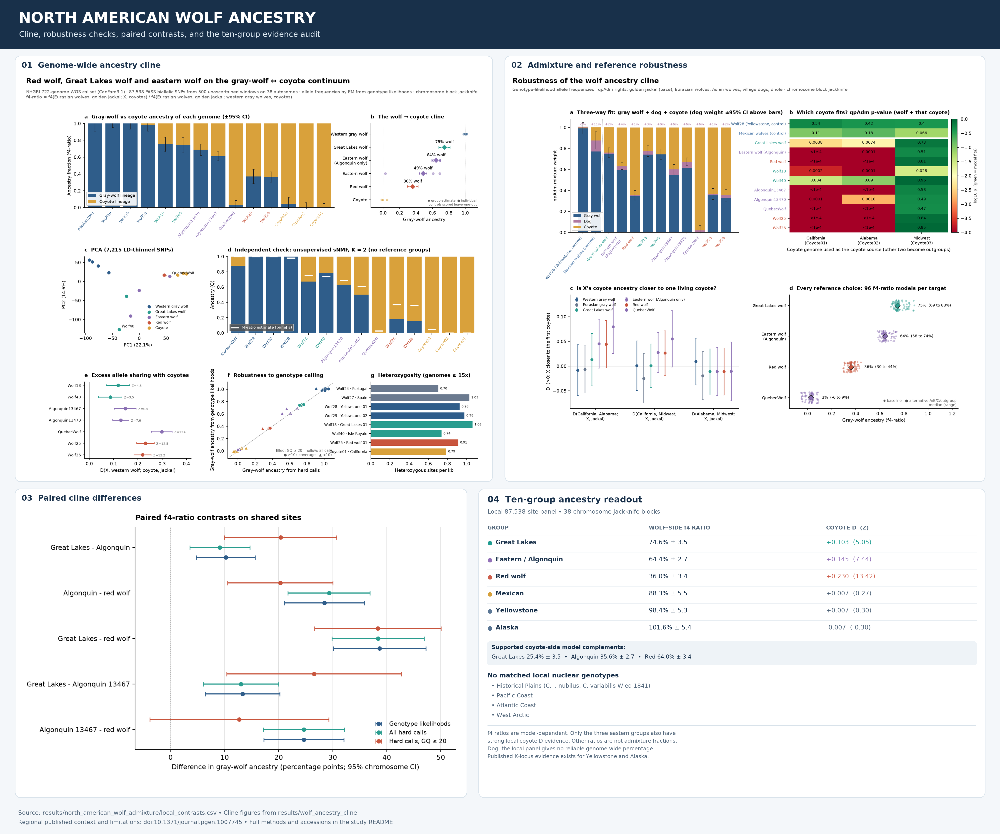

# Coyote and domestic-dog ancestry in ten North American wolf groups

**Local computation and evidence review, 29 September 2026.** The requested ten comprise Plains and Great Lakes wolves plus eight selected groups, including red wolves. These are **operational populations and lineages, not ten accepted subspecies**. Red wolves are often treated as *Canis rufus*, eastern-wolf status is disputed, and several names below are genomic clusters rather than Latin subspecies. [Sinding et al. 2018](https://doi.org/10.1371/journal.pgen.1007745) defined the sampled clusters; [Vilaça et al. 2023](https://doi.org/10.1093/molbev/msad055) tested the eastern-wolf history under a different evolutionary model.

The single-sheet PNG is generated from the existing figures and local results by [`scripts/build_wolf_study_overview.py`](../../scripts/build_wolf_study_overview.py).

## Locally recomputed results

I ran [`scripts/ten_wolf_local_admixture.py`](../../scripts/ten_wolf_local_admixture.py) against the repository's 38-genome, 87,538-site CanFam3.1 autosomal panel. For each group with identified genomes, the script estimates site frequencies from genotype likelihoods, then calculates an f4 ratio and Patterson's D with a chromosome-block jackknife. The western-wolf comparison excludes target genomes. These are **new computations on the local panel**, distinct from the published percentages below; all exact values and sample IDs are in [`local_contrasts.csv`](local_contrasts.csv), with run metadata in [`local_run.json`](local_run.json).

| Requested group | Local genomes | Wolf-side f4 ratio ± SE | Coyote D ± SE (Z) | Local reading |
|---|---:|---:|---:|---|
| Great Lakes | 2 | 0.746 ± 0.035 | 0.103 ± 0.020 (5.05) | Clear coyote-lineage affinity; model complement about 25% |
| Red | 2 | 0.360 ± 0.034 | 0.230 ± 0.017 (13.42) | Clear affinity; model complement about 64% |
| Eastern/Algonquin | 2 | 0.644 ± 0.027 | 0.145 ± 0.019 (7.44) | Clear affinity; model complement about 36% |
| Mexican | 2 | 0.883 ± 0.055 | 0.007 ± 0.026 (0.27) | Coyote affinity not resolved locally; ratio complement is not a supported admixture estimate |
| Yellowstone | 3 | 0.984 ± 0.053 | 0.007 ± 0.022 (0.31) | Coyote affinity not resolved locally |
| Alaska | 1 | 1.016 ± 0.054 | −0.007 ± 0.022 (−0.31) | Coyote affinity not resolved locally; ratio exceeds the nominal mixture bound |
| Historical Plains (*C. l. nubilus*) | 0 | — | — | No usable population-matched nuclear genotypes |
| Pacific Coast | 0 | — | — | Public reads identified; joint genotypes not yet computed |
| Atlantic Coast | 0 | — | — | Public reads identified; joint genotypes not yet computed |
| West Arctic | 0 | — | — | Public reads identified; joint genotypes not yet computed |

**Interpretation.** The f4 ratio is conditional on the chosen reference tree and measures ancestry along those reference lineages, not a direct recent-hybrid fraction. Its complement is shown only for the three eastern groups with strong independent D signals. The panel cannot resolve low proportions in Mexican, Yellowstone, or Alaskan wolves. D tests excess coyote allele sharing relative to the listed western wolves; null D does not prove absence. The panel has small samples and dog-reference mapping bias. The local dog-specific follow-ups are discussed below; a simple dog-versus-jackal D is confounded by wolf population structure and coyote ancestry, so it was excluded from the local result file.

### Plains name and data audit

The user's *Canis variabilis* is a valid historical synonym when cited as **_*Canis variabilis*_ Wied-Neuwied, 1841**, with a North Dakota type locality; *Canis lupus nubilus* Say, 1823 is the name used here. The later *C. variabilis* Pei, 1934 concerns a different Asian fossil canid. [Mammal Diversity Database synonymy](https://www.mammaldiversity.org/taxon/1005943/); [Mech 1974 taxonomic account](https://www.science.smith.edu/departments/biology/VHAYSSEN/msi/pdf/i0076-3519-037-01-0001.pdf).

I located an authenticated historical *C. l. nubilus* voucher, **MCZ:Mamm:BOM-11183** from Fort Kearny, Nebraska, linked to BioSample **SAMN19515123** and run **SRR14761957**. Its public run is marked WGS, but the submitted BAM header has **only one reference, coyote mitochondrial NC_008093.1 (16,724 bases)**; it was aligned against `CoyoteMitogenome.fa`. Thus this archived alignment cannot be inserted into our autosomal panel or used to estimate genome-wide coyote/dog admixture. This was checked locally by reading the BAM header, not inferred from the sample title. The archive title calls this a “historical Great Lakes wolf,” which conflicts with the voucher's Nebraska locality and *nubilus* identification; the specimen identity should be checked before any future comparison. [MCZ voucher](https://mczbase.mcz.harvard.edu/guid/MCZ%3AMamm%3ABOM-11183); [Sacks et al. 2021](https://doi.org/10.1111/mec.16048).

The missing regional genomes are traceable to [Sinding et al.'s read archive](https://www.ncbi.nlm.nih.gov/bioproject/PRJNA496590): Pacific Coast **SRR8066604**, Atlantic Coast **SRR8066601**, and West Arctic Banks and Victoria Islands **SRR8066615/SRR8066608**. Their public paired FASTQs total roughly **50, 35, 55, and 43 GB**, respectively. They need mapping and joint genotyping at comparable sites before being combined with this panel. A Saskatchewan wolf **SRR8066605** is also available, but lacks authentication as the historical Plains subspecies and has not been substituted for it. The [`missing_data_manifest.csv`](missing_data_manifest.csv) records these accessions and the specific gap.

## Published evidence for all ten groups

| Group | Coyote ancestry evidence | Dog ancestry evidence |
|---|---|---|
| **Historical Plains wolf** (*C. l. nubilus*; *C. variabilis* Wied-Neuwied, 1841) | **Unresolved.** No matched nuclear ancestry estimate for historical Plains specimens. | **Unresolved.** |
| **Great Lakes wolf** | **Strong coyote-lineage signal; ~25%** in a two-source f4 model. An eastern-wolf route for some of that ancestry is plausible. | **Not established** in population-specific genomic testing reviewed here. |
| **Red wolf** | **Strong; ~60% coyote-like** in the same model. This does not settle whether its lineage has older unique ancestry. | **Not established.** |
| **Eastern/Algonquin wolf** | **Strong; ~40% coyote-like** in the same model. Ancient and more recent gene flow both matter. | **Not established.** |
| **Mexican wolf** (*C. l. baileyi*) | **Low but detected; ~10%** in that model. | **Dedicated study finds no biologically significant ancestry** in 87 wolves. |
| **Pacific Coast wolf** | **Low but detected; ~5%** in that model. | **No recent dog/coyote hybrids** in a separate Pacific Northwest diagnostic-marker study; historical dog ancestry remains unquantified. |
| **Yellowstone/Rocky Mountain wolf** | **Low but detected; ~5%** in that model. | **Yes, historical and localized:** a dog-derived *CBD103/K* coat-color haplotype is documented in Yellowstone wolves. This is not a genome-wide dog percentage. |
| **Atlantic Coast wolf** | **Low but detected; ~10%** in that model. | **Not established.** |
| **Alaskan wolf** | **Detected by D statistics**, but the f4 proportion is unreliable because of additional Siberian-related wolf gene flow. | **Yes, historical and localized:** the dog-derived *K* haplotype occurs in sampled Alaskan wolves. Its origin may be farther east or north. |
| **West Arctic wolf** (Banks/Victoria Islands) | **Very low but detected; <3%** for Canadian archipelago wolves in the study. | **Not established.** |

**Answer to “which ones?”** Nine of these ten groups have published coyote-lineage evidence; the exception is the *unresolved* historical Plains wolf, not a demonstrated absence. Dog-origin DNA is directly documented at a particular selected locus in Yellowstone and Alaskan wolves. A focused genome-wide test argues against biologically significant dog ancestry in Mexican wolves. For the other seven groups, this review does not establish population-specific dog ancestry or its absence. [Sinding et al. 2018](https://doi.org/10.1371/journal.pgen.1007745); [Schweizer et al. 2018](https://doi.org/10.1093/molbev/msy031); [Fitak et al. 2018](https://doi.org/10.1093/jhered/esy009).

## Evidence and method

The coyote percentages are **one published comparison**, from Sinding et al.'s f4 ratios using a Polar wolf and Mexican coyote as reference endpoints. They are not direct measurements of recent hybridization, and they should not be interpreted as precise population-wide values. The authors found significant coyote affinity by D statistic across their sampled North American wolf-like populations, with red > eastern/Great Lakes > other gray wolf groups. Their Alaska f4 fit was distorted by additional Eurasian-related gene flow, so it gets no percentage here. Their Canadian-archipelago statement is “less than 3%” and is applied cautiously to the sampled West Arctic cluster. [Sinding et al. 2018, Results](https://journals.plos.org/plosgenetics/article?id=10.1371/journal.pgen.1007745).

The eastern interpretation has a material alternative: Vilaça et al. sequenced five each of Ontario eastern and Great Lakes wolves and inferred a distinct eastern lineage with older coyote admixture, then Great Lakes admixture between gray and eastern wolves. Their results support coyote-related ancestry but caution against treating every coyote-like segment as a recent direct wolf–coyote cross. They also found private red-wolf ancestry. [Vilaça et al. 2023](https://academic.oup.com/mbe/article/40/4/msad055/7103497). Earlier whole-genome analysis independently found gray-wolf/coyote admixture patterns in red and Great Lakes wolves. [vonHoldt et al. 2016](https://doi.org/10.1126/sciadv.1501714).

For dog ancestry, the strongest population-specific positive finding is the dog-derived *K* haplotype, which a 331-wolf targeted study observed in Alaska and Yellowstone, among other northern populations. The study inferred an older North American introgression and selection on the haplotype; its presence **does not imply that the sampled wolves are recent wolfdogs or give a genome-wide dog fraction**. [Anderson et al. 2009](https://doi.org/10.1126/science.1165448); [Schweizer et al. 2018](https://pgl.soe.ucsc.edu/schweizer18.pdf). For Mexican wolves, Fitak et al. genotyped 87 individuals at more than 172,000 SNPs and concluded that apparent dog assignments were consistent with incomplete lineage sorting, with no biologically significant dog ancestry. [Fitak et al. 2018](https://pubs.usgs.gov/publication/70196952). A study of recolonizing Pacific Northwest wolves found no **recent** dog or coyote ancestry with a 24-marker diagnostic panel; this is a narrower test than the whole-genome historical signal and a different sample set from the Pacific Coast cluster. [Hendricks et al. 2018](https://doi.org/10.1038/s41437-018-0094-x).

The Plains entry is intentionally unresolved. Leonard et al. sampled historical museum specimens labeled *C. l. nubilus*, but sequenced about 425 bp of mitochondrial DNA to study lost diversity. Sacks et al. later analyzed a Nebraska voucher's mitogenome; the archived alignment is mitochondrial only. Neither maternal result can support a genome-wide coyote or dog percentage; the “Central” wolves in Sinding et al. were not authenticated historical Plains specimens. [Leonard et al. 2005](https://www.consevol.org/pdf/Leonard_2005_MolEcol.pdf); [Sacks et al. 2021](https://doi.org/10.1111/mec.16048); [Sinding et al. 2018](https://doi.org/10.1371/journal.pgen.1007745).

## Cross-check against this repository's panel

The existing [wolf ancestry cline](../wolf_ancestry_cline/README.md) provides an independent, smaller analysis of **two red wolves, two Great Lakes wolves, and two Algonquin wolves** from an 87,538-SNP autosomal panel. Its genotype-likelihood f4 estimates are approximately **64% coyote-lineage for red, 25% for Great Lakes, and 36% for Algonquin** (complements of gray-wolf estimates of 36%, 75%, and 64%). Chromosome-jackknife standard errors are about 3–4 points, conditional on the reference model. The eastern genome `AlgonquinWolf13470` has a strong unexplained affinity to the Isle Royale genome, so the eastern estimate needs extra caution. The panel also includes two Mexican wolves, three Yellowstone wolves and one Alaskan wolf, but it was not designed or powered to estimate the small coyote fractions in those groups; its sample metadata contain no authenticated historical Plains wolf, Pacific Coast wolf, Atlantic Coast wolf, or West Arctic wolf. These local data therefore corroborate the **rank order** of the three eastern groups, not a ten-population ranking.

The same local analysis found that a three-source fit's apparent ~11% “dog” weight in its two Mexican wolves was **not dog-specific**: a direct dog-sharing contrast was null (Z = 0.15 with breed dogs; Z = 0.09 with village dogs), consistent with Fitak et al. The local SNP panel does not genotype the *K* haplotype in the cited Alaska or Yellowstone individuals and cannot independently confirm that localized dog signal. See [robustness analysis](../wolf_ancestry_cline/README.md#robustness-tests) and [source sample manifest](../../configs/examples/wolf_cline_samples.csv).

## Interpretation rules

- **“Coyote-lineage”** describes excess allele sharing with coyotes under the reference model. It may reflect ancient introgression, recent introgression, or an old eastern lineage related to coyotes; dates and direction are not resolved by these percentages.
- **“Dog ancestry not established”** is an evidence gap, not a zero estimate. Dog ancestry is especially hard to assign because dogs derive from wolves and a small selected dog segment can spread far without a large genome-wide dog contribution.
- **Published numbers are conditional on each study's sampling and methods.** Do not add the percentages across studies or transfer a regional estimate to every member of a named subspecies.

Machine-readable decisions are in [evidence_matrix.csv](evidence_matrix.csv).
