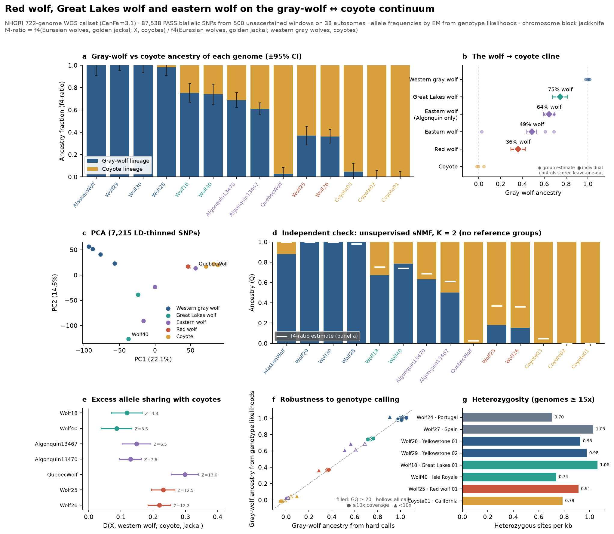
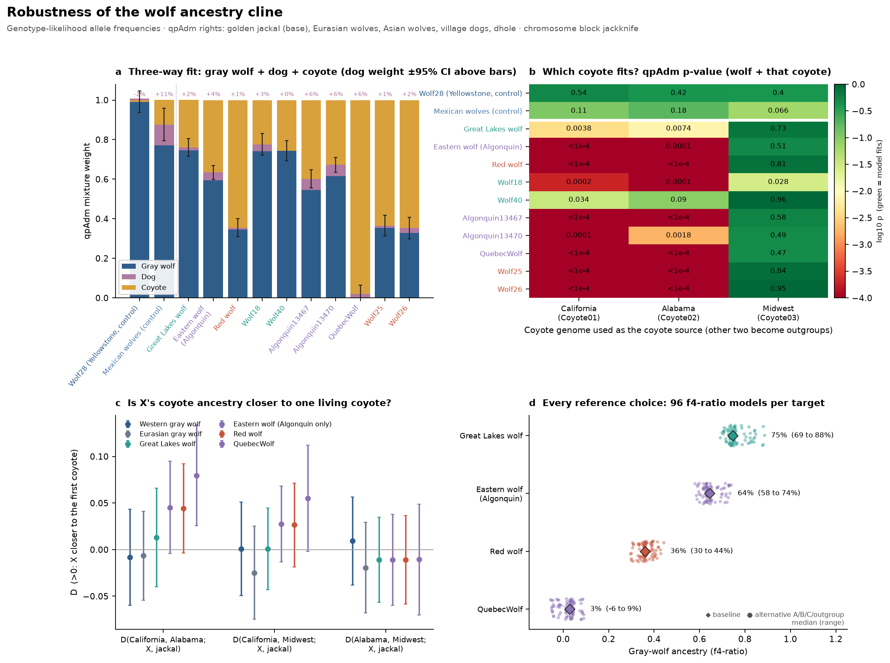

# Red wolf, Great Lakes wolf and eastern wolf on the gray-wolf ↔ coyote continuum

**Question.** North America's three "problem" wolves — the Great Lakes wolf, the eastern
(Algonquin) wolf and the red wolf — are each argued to be either distinct lineages or
products of gray-wolf × coyote hybridization. How much of each genome traces to the
gray-wolf lineage versus the coyote lineage, and do they form a west-to-south cline?



## Findings

Allele frequencies are estimated from genotype likelihoods (see *Genotype calling*
below); the hard-call columns are shown for comparison.

| Group | Genomes | Gray-wolf ancestry (f4-ratio, genotype likelihoods) | Hard calls, GQ ≥ 20 | All hard calls | D(X, western wolf; coyote, jackal) |
|---|---|---|---|---|---|
| Western gray wolf (control, leave-one-out) | 4 | 0.98–1.02 per genome | 0.91–1.05 | 0.98–1.02 | — |
| **Great Lakes wolf** | Wolf18, Wolf40 (Isle Royale) | **75% ± 4%** | 74% ± 5% | 74% ± 4% | 0.103, Z = 5.1 |
| **Eastern wolf, Algonquin only** | 2 | **64% ± 3%** | 56% ± 4% | 65% ± 3% | 0.145, Z = 7.4 |
| Eastern wolf, all three as labelled | + QuebecWolf | 49% ± 2% | 45% ± 4% | 49% ± 2% | 0.191, Z = 10.6 |
| **Red wolf** | Wolf25, Wolf26 | **36% ± 3%** | 36% ± 4% | 36% ± 3% | 0.230, Z = 13.4 |
| Coyote (control, leave-one-out) | 3 | −0.02–0.05 per genome | −0.05–0.09 | −0.03–0.04 | — |

(± is one chromosome-jackknife standard error; 38 autosome blocks.)

1. **A three-step cline, with the red-wolf step the largest.** Gray-wolf ancestry falls
   from ~75% in Great Lakes wolves to ~64% in Algonquin eastern wolves to ~36% in red
   wolves (64% coyote-lineage). Direct tests that need no reference model:
   D(red, Algonquin; coyote, jackal) = 0.101 (Z = 5.3),
   D(red, Great Lakes; coyote, jackal) = 0.145 (Z = 6.9),
   D(Algonquin, Great Lakes; coyote, jackal) = 0.053 (Z = 3.0).
   The Algonquin vs Great Lakes step is the weakest. It is Z = 2.5 on all hard calls and
   not significant (Z = 0.9) on GQ ≥ 20 calls, which discard 50–70% of the Algonquin data.
   Treat it as moderate evidence from two genomes per group.
2. **All three share significantly more alleles with coyotes than western gray wolves do**
   (every individual D > 0, Z = 3.5–12.5), so none is simply a gray-wolf population.
3. **Four independent views agree on the order.** The reference-based f4-ratio (panel a/b),
   unsupervised sNMF with no reference groups (panel d), PCA (panel c: Great Lakes →
   Algonquin → red wolf → coyote along PC1) and the D-statistics (panel e) all give the
   same order.
4. **The "QuebecWolf" genome is a coyote.** It scores ~3% gray-wolf ancestry, has the
   largest coyote D (Z = 13.6), and clusters with coyotes in PCA and sNMF. Its NCBI record
   (SAMN05736724) already calls it an "apparent gray wolf / coyote hybrid"; in this panel
   it is indistinguishable from coyotes (plausibly an eastern coyote, or a sample mix-up).
   It is kept in the labelled eastern-wolf group for transparency, but the Algonquin-only
   estimate is the one to quote.
5. **Isle Royale shows its bottleneck.** Among high-coverage genomes (panel g), the Isle
   Royale wolf (Wolf40) has the lowest heterozygosity of any North American wolf
   (0.74 het/kb vs 0.93–1.06 for Yellowstone and Great Lakes 01), consistent with that
   island population's documented inbreeding.

## Robustness tests



Produced by [`scripts/wolf_cline_robustness.py`](../../scripts/wolf_cline_robustness.py);
tables in [`robustness/`](robustness/). All tests use genotype-likelihood frequencies.

### 1. Is dog ancestry inflating the "gray wolf" estimates? Mostly no.

Dogs sit inside the gray-wolf clade, so the f4-ratio counts any dog ancestry as gray
wolf. qpAdm (Haak et al. 2015) fits each target as western gray wolf + dog (five North
American breeds) + coyote. The outgroups are golden jackal, Eurasian wolves, Asian
wolves, village dogs and dhole.

| Target | Gray wolf | Dog | Coyote | Fit p (3-way) | Fit p (wolf + coyote only) |
|---|---|---|---|---|---|
| Yellowstone wolf (control) | 101% ± 5% | −2% ± 3% | 1% ± 3% | 0.59 | 0.73 |
| Great Lakes wolf | 75% ± 5% | 2% ± 2% | 24% ± 4% | 0.36 | 0.28 |
| Eastern wolf (Algonquin) | 59% ± 3% | **4% ± 2%** (Z = 2.2) | 37% ± 3% | 0.63 | 0.21 |
| Red wolf | 35% ± 4% | 1% ± 2% | 65% ± 3% | 0.89 | 0.95 |

- **Red and Great Lakes wolves:** no detectable dog ancestry. Their gray-wolf estimates
  stand as they are.
- **Algonquin wolves (and the Quebec coyote):** weak evidence of ~4–6% dog ancestry
  (individual Z = 2.4–3.0). If real, about 5 points of the Algonquin "gray wolf" fraction
  is dog, and the true wolf fraction is nearer 59%.
- **Calibration warning.** The inbred captive Mexican wolves, included as a second
  control, also get 10% ± 4% dog (Z = 2.5). That may be real, but it also shows that
  dog signals at Z ≈ 2–3 are suggestive, not conclusive.
- Wolf18 (Great Lakes 01) is the one genome no model fits well (p = 0.005–0.03).
  Something in its ancestry is not captured by western wolf + dog + coyote.

### 2. Where did the coyote-side ancestry come from? A shared eastern component.

Recent local hybridization predicts that each target's coyote component matches the
coyotes living near it. A long-separate lineage predicts it matches no living coyote
better than another. qpAdm was run with each coyote genome as the source and the
other two as outgroups (panel b):

| Target | California coyote as source | Alabama coyote | Midwest coyote |
|---|---|---|---|
| Yellowstone wolf (control) | p = 0.54 | 0.42 | 0.40 |
| Mexican wolves (control) | 0.11 | 0.18 | 0.07 |
| Great Lakes wolf | 0.004 | 0.007 | **0.73** |
| Eastern wolf (Algonquin) | <1e-4 | 1e-4 | **0.51** |
| Red wolf | <1e-4 | <1e-4 | **0.81** |

- **Only the Midwest coyote fits.** For every target and every individual genome
  (including QuebecWolf), the Midwest coyote is the only coyote that works as a source.
  The controls fit with any coyote, so this is not an artifact of that genome's coverage.
- **The Midwest coyote is itself admixed.** Modelled as gray wolf + another coyote, it
  needs 13–18% extra ancestry and still fails (p ≤ 1e-4). The California and Alabama
  coyotes fit each other cleanly (p = 0.22). So the Midwest coyote carries a component
  that is not western-gray-wolf-like, and it shares that component with all three
  eastern wolves.
- **Interpretation.** These wolves don't derive their coyote ancestry *from* Midwest
  coyotes. Rather, there is a **shared eastern North American component**: present in
  Great Lakes wolves, Algonquin wolves, red wolves and at least one Midwest coyote,
  absent from California and Alabama coyotes and from western wolves.
- **Not what simple local hybridization predicts for red wolves.** The Alabama coyote,
  geographically closest to the red wolf's historic range, fits red wolves worst.
  Caveat: coyotes only reached the Southeast in the 20th century, so a modern Alabama
  coyote is an imperfect proxy for the coyotes red wolves met.
- **The simple D-tests don't show this on their own.** The D(coyote i, coyote j; X,
  jackal) tests (panel c) are all non-significant (|Z| ≤ 1.8 for the target groups), and
  if anything they lean slightly toward the California coyote. The qpAdm signal comes
  from combining many f4 statistics, including those against the wolf outgroups. It
  rests on a single 8× Midwest coyote genome, so it needs replication with more coyotes
  before it carries much weight.

### 3. Does the answer depend on which reference genomes were chosen? No.

The f4-ratio was recomputed for 96 combinations per target (panel d):

- **Eurasian reference:** all six Eurasian wolves / Europe only / Asia only.
- **North American wolf reference:** Yellowstone + Alaska / Yellowstone / Alaska / Mexican.
- **Coyote reference:** all three / each coyote alone.
- **Outgroup:** golden jackal / dhole.

Results:

- **Medians:** Great Lakes 75% (range 69–88%), Algonquin 64% (58–74%), red wolf 36%
  (30–44%), QuebecWolf 3% (−6–9%).
- **The ordering holds in all 96 of 96 models.**
- **The one systematic shift:** using Mexican wolves as the North American wolf reference
  raises every target by 4–8 points.

### Genotype calling

The GQ ≥ 20 filter used in the first version removed 50–80% of calls from the 5–7×
genomes, mostly homozygous-reference ones. Frequencies are now fitted by EM directly from
the genotype likelihoods (Kim et al. 2011), which uses every read without forcing a
hard call. Evidence that this is the better choice:

- The likelihood estimates agree with all-hard-call estimates to within ~1 point
  (panel f of the main figure).
- They also place the controls closest to their true values.
- The GQ ≥ 20 set was the outlier, and it was biased mainly for the Algonquin wolves.

`tests/unit/test_f_statistics.py` checks the EM on simulated 2× reads, where hard calls
are biased and the EM is not.

### How this fits the literature

The order and rough magnitudes agree with vonHoldt et al. 2016 (doi:10.1126/sciadv.1501714).
They reported red wolves as roughly three-quarters coyote ancestry, Algonquin wolves as
intermediate, and Great Lakes wolves as predominantly gray wolf with a coyote component.
Our Great Lakes value (75% wolf) sits at the more coyote-rich end of that picture. Any
eastern-wolf ancestry in Great Lakes wolves is counted on the coyote side here (see the
first caveat below).

## What this can and cannot say

- **"Coyote lineage" means the non-gray-wolf side of the tree.** The f4-ratio measures
  drift shared with coyotes versus the gray-wolf stem. It **cannot distinguish recent
  coyote admixture from an old, distinct North American lineage that is sister to
  coyotes** (the *Canis lycaon* / *C. rufus* "distinct species" hypothesis). The shared
  eastern component in robustness test 2 fits either story: an old eastern lineage whose
  ancestry persists across these canids, or a history of hybridization that has spread
  one gene pool through them. Separating the two needs ancestry-tract lengths or
  divergence-time modeling (SMC++, momi2), not these summary statistics.
- **Tiny samples.** Two or three genomes per target group, a single genome per coyote
  locality, and red wolves from the captive breeding program. These are genome-wide
  estimates for *these individuals*, not population-wide parameters.
- **Low coverage.** Five of seven target genomes are 5–7×. Genotype-likelihood
  frequencies handle this for the f-statistics. Heterozygosity does not, so panel g
  shows only ≥ 15× genomes.
- **Reference bias.** Reads were mapped to the dog assembly (CanFam3.1), which is closer to
  wolves than to coyotes.
- **Panel-relative heterozygosity.** Heterozygous sites per kb of fetched window, scaled by
  the site density of the joint callset. It is comparable between samples here, but it is
  not an absolute genome-wide π.
- This is exploratory comparative genomics, not a taxonomic or conservation-management
  determination.

## Data and methods

- **Source:** the NHGRI Dog Genome Project 722-genome joint callset
  (`722g.990.SNP.INDEL.chrAll.vcf.gz`, BioProject PRJNA448733, Plassais et al. 2019,
  doi:10.1038/s41467-019-09373-w), read by indexed byte range only: **2.0 GB transferred
  of a 309 GB file**. Sample identities come from the source's `722g_Metadata_May2018.xlsx`
  and NCBI BioSample records (see [`wolf_cline_samples.csv`](../../configs/examples/wolf_cline_samples.csv)).
  Target genomes: vonHoldt et al. 2016 (PRJNA255370; red wolves Wolf25/26, Great Lakes 01),
  PRJNA299506 (Isle Royale), PRJNA331222 (Algonquin and Quebec).
- **Panel:** 500 contiguous windows (~4 MB compressed each) evenly spaced across the 38
  autosomes, for 38 genomes: the targets plus coyotes, western/Mexican/Eurasian/Asian gray
  wolves, dogs, village dogs, golden jackal and dhole. Every PASS biallelic SNP in a window
  is kept, so the panel is **not ascertained** on dog SNP arrays: **87,538 SNPs** variable
  in this cohort.
- **f4-ratio:** α = f4(Eurasian wolves, golden jackal; X, coyotes) /
  f4(Eurasian wolves, golden jackal; western gray wolves, coyotes) (Patterson et al. 2012).
  Eurasian wolves: Altai, Chukotka, Bryansk, Croatia, Portugal, Spain. Western gray
  wolves: Yellowstone ×3, Alaska. Controls are scored leave-one-out.
- **qpAdm:** least-squares mixture weights with a block-jackknife χ² test of the model's
  remaining constraints (`canidae.analysis.f_statistics.qpadm`). This is a light
  reimplementation, not ADMIXTOOLS.
- **Validation:** msprime simulations with known two- and three-way admixture confirm that
  the f4-ratio and qpAdm recover the true weights, that correct qpAdm models fit, and that
  a model missing a source is rejected (`tests/unit/test_f_statistics.py`).
- **Uncertainty:** weighted delete-one block jackknife with each autosome as a block.
- **PCA / sNMF:** North American genomes, all hard calls, ≥ 90% call rate, MAF ≥ 5%,
  thinned to one SNP per 2 kb (7,215 SNPs); sNMF K = 2, best of 5 restarts. sNMF tends to
  pull intermediate genomes toward a pole (red wolves 15–18% wolf there vs 36% by
  f4-ratio), which is why the f4-ratio is the headline estimate.

## Files

| File | Contents |
|---|---|
| `wolf_ancestry_cline.png` / `.svg` | Main figure |
| `f4_ratio_wolf_ancestry.csv` | Gray-wolf ancestry per group and genome, all three genotype treatments |
| `d_statistics.csv` | D(X, western wolf; coyote, jackal) per group and genome |
| `pca_snmf.csv` | PC1/PC2 and sNMF K = 2 proportions |
| `sample_qc_heterozygosity.csv` | Coverage, missingness, heterozygosity |
| `summary.json` | Everything above plus the between-target D contrasts |
| `robustness/wolf_cline_robustness.png` / `.svg` | Robustness figure |
| `robustness/qpadm_dog_ancestry.csv` | Three-way and two-way qpAdm fits |
| `robustness/qpadm_coyote_source.csv` | qpAdm with each coyote genome as the source |
| `robustness/qpadm_coyote_as_target.csv` | Each coyote modelled as gray wolf + another coyote |
| `robustness/d_coyote_pairs.csv` | D(coyote i, coyote j; X, jackal) |
| `robustness/reference_rotation.csv` | All 96 f4-ratio models per target |
| `robustness/summary.json` | Summary of the robustness tests |

## Reproduce

```bash
python scripts/fetch_wolf_cline_panel.py --windows 500 --window-bytes 4000000 --threads 6
python scripts/wolf_ancestry_cline.py
python scripts/wolf_cline_robustness.py
```

The fetch writes `data/wolf_cline/panel.npz` (gitignored); each analysis runs in under a
minute.
